[](https://mseep.ai/app/zhaoxingpeng-dbjavagenix)

# DBJavaGenix

> Convierte la "ingeniería inversa de bases de datos mediante LLM" en un proceso repetible y auditable.
> Las Skills definen "cómo hacerlo" · MCP proporciona "qué se puede hacer" · Las MCP Apps hacen los resultados "visibles".

```mermaid
graph LR
    Client[Claude Desktop / Cursor / Cherry] -->|Carga de Skill| Skills
    Skills[".claude/skills/<br/>java-codegen-from-db<br/>springboot-migration"]
    Skills -->|Llamada según necesidad| MCP

    subgraph MCP[Servidor MCP 33 herramientas]
        direction TB
        DB[db_* conexión / consulta / descripción]
        Atom[codegen_build_context<br/>codegen_render_entity/dao/service/<br/>controller/dto/mapper]
        Graph[schema_topo_order<br/>schema_cluster_tables<br/>schema_check_cycles]
        AI[ai_infer_business_names<br/>ai_recommend_template<br/>ai_summarize_schema]
        Vis[db_render_er_diagram]
        Obs[server_metrics / server_health<br/>ai_metrics / search_tools]
    end

    MCP -->|Retorna _meta| Apps[Renderizado MCP Apps]
    Apps -->|mermaid / dashboard / code-diff / tree| Client
    MCP -->|Lee| Data[MySQL / PostgreSQL / SQLite + plantillas Mustache]
```

[](https://github.com/ZhaoXingPeng/DBJavaGenix/actions/workflows/ci.yml)



## ¿Qué problema resuelve?

Generar ingeniería inversa de tablas de bases de datos a proyectos Spring Boot (Entity/DAO/Service/Controller/Mapper) no es nuevo: EasyCode, MyBatis-Plus Generator y Renren-generator llevan años haciéndolo. **La diferencia en la era de los LLM es:**

| Dimensión | Herramientas antiguas | DBJavaGenix v0.2 |
|------|--------|------------------|
| ¿Quién define el flujo? | El usuario hace clic en paneles de configuración en el IDE | **Orquestación explícita mediante archivos Skill** (el LLM no llama erróneamente) |
| Granularidad de llamada | Un solo botón hace todo de golpe | **7 herramientas atómicas** (build_context + 6 render_*), el LLM permite al usuario modificar el contexto para regenerar |
| Sobrecarga de inicio | (Plugin, residente) | Predeterminado ~3300 tok / modo progresivo **~985 tok** (ahorro del 70%) |
| Nomenclatura | Mapeo mecánico de prefijos de tabla | **15 reglas + API de Claude**, identifica patrones RBAC/ecommerce/CMS |
| Visualización de salida | Texto dentro del IDE | **MCP Apps**: Diagrama ER Mermaid / panel de dependencias / code-diff / árbol de estructura de paquetes |
| Observabilidad | Ninguna | server_metrics + ai_metrics + server_health |

## Inicio rápido

### Docker (Recomendado)

```bash
docker build -t dbjavagenix:latest .
```

Añade a `claude_desktop_config.json`:
```json
{
  "mcpServers": {
    "dbjavagenix": {
      "command": "docker",
      "args": ["run", "-i", "--rm",
               "-e", "DBJAVAGENIX_PROGRESSIVE=1",
               "-e", "ANTHROPIC_API_KEY",
               "dbjavagenix:latest"]
    }
  }
}
```

### Desarrollo local

```bash
git clone https://github.com/ZhaoXingPeng/DBJavaGenix.git
cd DBJavaGenix
uv venv && uv pip install -e ".[dev]"
PYTHONPATH=src python -m dbjavagenix.cli server
```

### Primer uso

En el cliente LLM, di "**Genera código Spring Boot a partir de las tres tablas sys_user / sys_role / sys_user_role de la base de datos myapp**", Claude hará:

1. Cargará la Skill `java-codegen-from-db` y avanzará en un flujo de trabajo de 5 fases
2. Llamará a `db_connect_test` → `db_table_describe` → `db_table_foreign_keys` para recopilar el schema
3. Llamará a `db_render_er_diagram` → el cliente renderizará el diagrama ER Mermaid
4. Llamará a `ai_infer_business_names` para inferir → `sys_user_role` debería ser `UserRoleAssignment`
5. Llamará a `ai_recommend_template` para recomendar → detectará RBAC y recomendará `MybatisPlus-Mixed`
6. Usará `codegen_build_context` + 5 `codegen_render_*` para generar por capas, devolviendo code-diff en cada capa
7. Tras la confirmación del usuario, escribirá en disco

## Capacidades principales (Fase 1 → 5)

### Fase 1: Base modernizada
- Python ≥ 3.11 / mcp ≥ 1.6 / Plantillas Spring Boot 3.5 + Java 21
- +360 pruebas unitarias, CI de GitHub Actions con 3 trabajos (lint / template-render / docker-build)
- Dockerfile multi-etapa (`python:3.11-slim` + usuario sin root)

### Fase 2: Capa de Skills y herramientas atómicas
- `.claude/skills/java-codegen-from-db/SKILL.md` define explícitamente el flujo de trabajo de 5 fases
- `db_codegen_generate` se divide en 7 herramientas atómicas, con contexto transferido explícitamente
- La herramienta `search_tools` implementa descubrimiento progresivo, ahorrando un 70.2% de tokens de inicio
- Segunda Skill `springboot-migration` (lista de verificación de actualización 2.7→3.x)
- [token usage benchmark](docs/benchmarks/token-usage.md)

### Fase 3: Integración de MCP Apps
4 componentes de UI interactivos:

| Componente | Tipo | Herramienta origen |
|------|------|---------|
| Diagrama ER | `mermaid` | `db_render_er_diagram` |
| Panel de salud de dependencias | `dashboard` | `springboot_analyze_dependencies` |
| Vista previa de código + Diff | `code-diff` | `codegen_render_*` (6) |
| Árbol de estructura de paquetes | `tree` | `db_codegen_generate` |

[Compatibilidad con clientes](docs/screenshots/README.md) + [validación headless](scripts/verify_mcp_apps.py).

### Fase 4: Mejora semántica con IA
- `ai_infer_business_names`: 15 reglas + Claude API opcional (SDK de Anthropic + caché de prompts)
- `ai_recommend_template`: Detecta 4 patrones: RBAC / ecommerce / CMS / tickets
- `ai_summarize_schema`: Resumen en lenguaje natural de toda la base de datos
- `ai_metrics`: Expone cache_hit_rate / tokens_saved
- Decisión de diseño: **Reglas antes que LLM**, funciona sin `ANTHROPIC_API_KEY`

### Fase 5: Observabilidad y listo para producción
- `server_metrics`: calls / avg_duration / error_rate de cada herramienta
- `server_health`: versiones de Python / mcp / SDK de anthropic + estado de importación de módulos
- Logs estructurados: `DBJAVAGENIX_LOG_FORMAT=json` permite salida de JSON en una sola línea, ideal para Loki/ELK
- [Manual de despliegue](docs/deployment.md): 3 modos de despliegue + 6 escenarios de troubleshooting

## Resumen de herramientas (33 en total)

| Categoría | Herramienta |
|------|------|
| Conexión / Consulta | db_connect_test / db_query_databases / db_query_tables / db_query_table_exists / db_query_execute |
| Estructura de tabla | db_table_describe / db_table_columns / db_table_primary_keys / db_table_foreign_keys / db_table_indexes |
| Algoritmos de grafo de schema | schema_topo_order / schema_cluster_tables / schema_check_cycles |
| Generación de código (atómica) | codegen_build_context / codegen_render_entity / codegen_render_dao / codegen_render_service / codegen_render_controller / codegen_render_dto / codegen_render_mapper |
| Generación de código (legada) | db_codegen_analyze / db_codegen_generate |
| Proyectos Spring Boot | springboot_validate_project / springboot_analyze_dependencies / springboot_read_config |
| Visualización | db_render_er_diagram |
| Semántica IA | ai_infer_business_names / ai_recommend_template / ai_summarize_schema / ai_metrics |
| Observabilidad | server_metrics / server_health |
| Herramienta meta | search_tools (descubrimiento progresivo) |

## Comparación con herramientas similares

| Dimensión | DBJavaGenix v0.2 | EasyCode | MyBatis-Plus generator | Renren-generator |
|------|------------------|----------|----------------------|-----------------|
| Motor de ejecución | LLM + MCP | Plugin para IDEA | Línea de comandos / Plugin Maven | Interfaz Web |
| Orquestación de flujo | Skill explícita de 5 fases | Panel de configuración | Código único | Formulario |
| Granularidad de herramienta | 7 atómicas (permite corrección intermedia) | Botón único | Comando único | Botón único |
| Nomenclatura IA | ✅ 15 reglas + LLM opcional | ❌ Solo plantillas | ❌ | ❌ |
| Extensión de plantillas | ✅ Mustache + 4 categorías (incluye sb35-java21) | ✅ Velocity | ⚠️ Solo MybatisPlus | ⚠️ Solo freemarker |
| Renderizado de diagrama ER | ✅ Mermaid (MCP App) | ❌ | ❌ | ⚠️ Estático |
| Adaptación de dependencias | ✅ Perfil inteligente + puntuación de salud | ❌ | ❌ | ❌ |
| Observabilidad | ✅ Métricas in-process + health | ❌ | ❌ | ❌ |
| Compatibilidad de cliente | Claude Desktop / Cursor / Cherry / ... | Solo IDEA | CLI | Navegador |

## Arquitectura técnica

Consulta [`iteration-plan/01-target-architecture.md`](iteration-plan/01-target-architecture.md) para más detalles. Tres capas de responsabilidades:

```
[ Capa Skills ]  Define "cómo hacerlo" — .claude/skills/*.md  Flujo de 5 fases explícito
       ↓
[ Capa MCP ]     Proporciona "qué se puede hacer" — 33 herramientas  Contexto transferido explícitamente
       ↓
[ Capa Apps ]    Hace los resultados "visibles" — 4 componentes de UI (mermaid/dashboard/code-diff/tree)
```

Cada capa practica "contención de ingeniería":
- No se introduce una base de datos vectorial (el schema es datos estructurados, el LLM lo lee directamente con mayor precisión)
- No se introduce LangChain (el Skill ya orquesta explícitamente, no se necesita abstracción de chain)
- No se introduce prometheus_client / opentelemetry-sdk (un proceso single con stdio es sobre-diseño)

## Documentación

| Documento | Contenido |
|------|------|
| [iteration-plan/](iteration-plan/) | Plan de refactorización en 6 fases (arquitectura objetivo / roadmap / registro de decisiones / historias de demostración) |
| [docs/deployment.md](docs/deployment.md) | Modos de despliegue / Variables de entorno / Health check / Solución de problemas |
| [docs/benchmarks/token-usage.md](docs/benchmarks/token-usage.md) | Medición de tokens del schema de herramientas |
| [docs/roadmap-v0.3.md](docs/roadmap-v0.3.md) | Plan de cierre para arquitectura, integración, calidad y publicación |
| [docs/screenshots/README.md](docs/screenshots/README.md) | Compatibilidad del cliente con 4 componentes MCP Apps |
| [docs/algorithms-overview.md](docs/algorithms-overview.md) | Algoritmos de gráficos de schema v0.2.1 (topo / cluster / cycle) |
| [docs/design-patterns-catalog.md](docs/design-patterns-catalog.md) | Patrones de diseño en el generador y en el código generado |
| [docs/adr/](docs/adr/) | 10 ADR (arquitectura / atómica / progresiva / reglas / sin dependencias / algoritmos de schema / configuración estándar / MCP v3 / caché 1h / agentic) |
| [.claude/skills/java-codegen-from-db/SKILL.md](.claude/skills/java-codegen-from-db/SKILL.md) | Skill principal: Flujo de 5 fases para generación de código |
| [.claude/skills/springboot-migration/SKILL.md](.claude/skills/springboot-migration/SKILL.md) | Segunda Skill: Migración de Spring Boot 2.7→3.x |

## Hoja de ruta

- [x] **Fase 1**: Modernización de infraestructura (Python 3.11 / mcp 1.6 / Plantillas Spring Boot 3.5 / CI / Docker)
- [x] **Fase 2**: Extracción de capa de Skills + herramientas atómicas + Descubrimiento Progresivo (token -70%)
- [x] **Fase 3**: Integración de MCP Apps (4 componentes de UI)
- [x] **Fase 4**: Mejora semántica con IA (reglas + LLM opcional)
- [x] **Fase 5**: Observabilidad + listo para producción
- [x] **Fase 6**: Documentación y demostraciones
- [x] **v0.2.1**: Completado de ingeniería Java (3 algoritmos de schema / generador de configuración de estándares / catálogo de patrones)
- [x] **v0.2.2**: MCP v3 + Ingeniería de IA (formularios de elicitation / sampling con LLM / caché de prompts 1h / agentic-runner)

Próximos pasos (v0.3):
- Las prioridades, requisitos previos y evidencias de aceptación se mantienen en [`docs/roadmap-v0.3.md`](docs/roadmap-v0.3.md).
- La lista describe candidatos; no comunica mejoras de rendimiento ni soporte de base de datos no verificados.

## Modos de inicio

| Modo | Punto de entrada | Disparador | Dependencias | Casos de uso |
|------|------|------|------|---------|
| Servidor MCP | `dbjavagenix server` | Conexión de cliente (Claude Desktop / Cursor, etc.) | Ninguna adicional | Exploración / Interacción multi-ronda / Predeterminado |
| Agentic runner | `server.agentic_runner.run_agentic()` | Ejecución única por CLI | `claude-agent-sdk` + `ANTHROPIC_API_KEY` | Procesos por lotes / CI / Tareas únicas |

Ambos modos comparten el mismo registro `database.mcp_tools` (ADR-010).

## Consejos de depuración

```bash
# Activar modo progresivo (expone solo 6 herramientas always_visible)
DBJAVAGENIX_PROGRESSIVE=1 PYTHONPATH=src python -m dbjavagenix.cli server

# Logs JSON (ideal para Loki / ELK)
DBJAVAGENIX_LOG_FORMAT=json DBJAVAGENIX_LOG_LEVEL=DEBUG \
  PYTHONPATH=src python -m dbjavagenix.cli server

# Validación headless de todos los componentes MCP App
PYTHONPATH=src python scripts/verify_mcp_apps.py
```

## Contribuciones

1. Fork → Crea una rama `feature/*`
2. Escribe pruebas (`tests/unit/`), `pytest tests/unit/` , debería debe pasar las 360+
3. `ruff check src/ tests/` debe pasar (CI lo ejecutará)
4. Abre un PR, / vinculado a la fase correspondiente del iteration-plan

## Licencia

MIT — Ver [LICENSE](LICENSE).

## Agradecimientos

- [EasyCode](https://github.com/makejavas/EasyCode) — Inspiración para el diseño de plantillas tempranas
- [Model Context Protocol](https://modelcontextprotocol.io/) — Anthropic / Linux Foundation
- [Anthropic Claude](https://www.anthropic.com/) — Capa de semántica IA

## Contacto

- Autor: ZXP · Email: 2638265504@qq.com
- Repositorio: https://github.com/ZhaoXingPeng/DBJavaGenix
- Issues: https://github.com/ZhaoXingPeng/DBJavaGenix/issues
