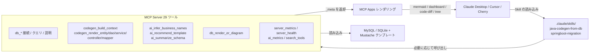

[](https://mseep.ai/app/zhaoxingpeng-dbjavagenix)

# DBJavaGenix

> 「LLM にデータベースを見せてリバースエンジニアリングする」作業を、再現可能で監査できるプロセスにします。
> Skills は「方法」を定義し、MCP は「できること」を提供し、MCP Apps は結果を「見える化」します。

[](https://github.com/ZhaoXingPeng/DBJavaGenix/actions/workflows/ci.yml)



## 解決する課題

データベースのテーブルから Spring Boot プロジェクト（Entity/DAO/Service/Controller/Mapper）を生成すること自体は新しくありません。EasyCode、MyBatis-Plus Generator、Renren-generator などが長年この課題を解決してきました。**LLM 時代の違いは次のとおりです。**

| 観点 | 従来のツール | DBJavaGenix v0.2 |
|------|-------------|------------------|
| ワークフローの定義者 | IDE の設定画面をユーザーが操作 | **Skill ファイルで明示的に編成**（LLM の誤呼び出しを防止） |
| 呼び出し単位 | 1 つのボタンですべてを一括実行 | **6 つのアトミックツール**（build_context + 5 つの render_*）。途中で context を修正して再生成可能 |
| 起動コスト | プラグインを常駐 | 通常約 3,300 tok / Progressive モード **約 985 tok**（70% 削減） |
| 命名 | テーブル接頭辞の機械的な変換 | **15 のルール + Claude API** で RBAC / EC / CMS パターンを認識 |
| 出力の可視化 | IDE 内のテキスト | **MCP Apps**: Mermaid ER 図 / 依存関係ダッシュボード / code-diff / パッケージツリー |
| 可観測性 | なし | server_metrics + ai_metrics + server_health |

## クイックスタート

### Docker（推奨）

```bash
docker build -t dbjavagenix:latest .
```

`claude_desktop_config.json` に追加します。

```json
{
  "mcpServers": {
    "dbjavagenix": {
      "command": "docker",
      "args": ["run", "-i", "--rm",
               "-e", "DBJAVAGENIX_PROGRESSIVE=1",
               "-e", "ANTHROPIC_API_KEY",
               "dbjavagenix:latest"]
    }
  }
}
```

### ローカル開発

```bash
git clone https://github.com/ZhaoXingPeng/DBJavaGenix.git
cd DBJavaGenix
uv venv && uv pip install -e ".[dev]"
PYTHONPATH=src python -m dbjavagenix.cli server
```

### 初回利用

LLM クライアントで、例えば **「myapp データベースの sys_user / sys_role / sys_user_role の 3 テーブルから Spring Boot コードを生成して」** と依頼すると、Claude は次の処理を行います。

1. `java-codegen-from-db` Skill を読み込み、5 段階のワークフローを進める
2. `db_connect_test` → `db_table_describe` → `db_table_foreign_keys` を呼び出してスキーマを収集する
3. `db_render_er_diagram` を呼び出し、クライアントで Mermaid ER 図を描画する
4. `ai_infer_business_names` で意味を推定し、`sys_user_role` を `UserRoleAssignment` と命名する
5. `ai_recommend_template` でテンプレートを推薦し、RBAC を検出して `MybatisPlus-Mixed` を提案する
6. `codegen_build_context` + 5 つの `codegen_render_*` でレイヤーごとに生成し、各レイヤーの code-diff を返す
7. ユーザーの確認後にファイルへ書き込む

## 主な機能（Phase 1 → 5）

### Phase 1: モダンな基盤

- Python ≥ 3.11 / mcp ≥ 1.6 / Spring Boot 3.5 + Java 21 テンプレート
- 360 以上のユニットテスト、GitHub Actions の 3 ジョブ（lint / template-render / docker-build）
- マルチステージ Dockerfile（`python:3.11-slim` + 非 root ユーザー）

### Phase 2: Skills 層とアトミックツール

- `.claude/skills/java-codegen-from-db/SKILL.md` が 5 段階のワークフローを明示
- `db_codegen_generate` を 6 つのアトミックツールへ分割し、context を明示的に受け渡し
- `search_tools` が Progressive Discovery を実装し、起動時のトークンを 70.2% 削減
- 2 つ目の Skill `springboot-migration`（2.7 → 3.x 移行チェックリスト）
- [トークン使用量ベンチマーク](docs/benchmarks/token-usage.md)

### Phase 3: MCP Apps 統合

4 つのインタラクティブ UI コンポーネントを提供します。

| コンポーネント | 種類 | 元のツール |
|------|------|---------|
| ER 図 | `mermaid` | `db_render_er_diagram` |
| 依存関係ヘルスダッシュボード | `dashboard` | `springboot_analyze_dependencies` |
| コードプレビュー + Diff | `code-diff` | `codegen_render_*`（6 ツール） |
| パッケージ構造ツリー | `tree` | `db_codegen_generate` |

[クライアント互換性](docs/screenshots/README.md) と [headless 検証](scripts/verify_mcp_apps.py) も参照してください。

### Phase 4: AI による意味付けの強化

- `ai_infer_business_names`: 15 のルール + オプションの Claude API（Anthropic SDK + prompt caching）
- `ai_recommend_template`: RBAC / EC / CMS / チケット管理の 4 パターンを検出
- `ai_summarize_schema`: データベース全体を自然言語で要約
- `ai_metrics`: cache_hit_rate / tokens_saved を公開
- 設計方針: **ルールを LLM より先に適用**し、`ANTHROPIC_API_KEY` なしでも動作

### Phase 5: 可観測性と本番対応

- `server_metrics`: ツールごとの calls / avg_duration / error_rate
- `server_health`: Python / mcp / anthropic SDK のバージョンとモジュール読み込み状態
- 構造化ログ: `DBJAVAGENIX_LOG_FORMAT=json` で Loki / ELK に適した 1 行 JSON を出力
- [デプロイガイド](docs/deployment.md): 3 つのデプロイ方式 + 6 つのトラブルシューティング事例

## ツール一覧（29 個）

| カテゴリ | ツール |
|------|------|
| 接続 / クエリ | db_connect_test / db_query_databases / db_query_tables / db_query_table_exists / db_query_execute |
| テーブル構造 | db_table_describe / db_table_columns / db_table_primary_keys / db_table_foreign_keys / db_table_indexes |
| コード生成（アトミック） | codegen_build_context / codegen_render_entity / codegen_render_dao / codegen_render_service / codegen_render_controller / codegen_render_mapper |
| コード生成（レガシー） | db_codegen_analyze / db_codegen_generate |
| Spring Boot プロジェクト | springboot_validate_project / springboot_analyze_dependencies / springboot_read_config |
| 可視化 | db_render_er_diagram |
| AI による意味付け | ai_infer_business_names / ai_recommend_template / ai_summarize_schema / ai_metrics |
| 可観測性 | server_metrics / server_health |
| メタツール | search_tools（Progressive Discovery） |

## 類似ツールとの比較

| 観点 | DBJavaGenix v0.2 | EasyCode | MyBatis-Plus generator | Renren-generator |
|------|------------------|----------|----------------------|-----------------|
| 実行方式 | LLM + MCP | IDEA プラグイン | CLI / Maven plugin | Web UI |
| ワークフロー編成 | 5 段階の明示的な Skill | 設定画面 | 一括生成 | フォーム |
| ツール粒度 | 6 つのアトミックツール（途中修正可能） | 1 ボタン | 1 コマンド | 1 ボタン |
| AI 命名 | ✅ 15 ルール + オプション LLM | ❌ テンプレートのみ | ❌ | ❌ |
| テンプレート拡張 | ✅ Mustache + 4 カテゴリ（sb35-java21 を含む） | ✅ Velocity | ⚠️ MybatisPlus のみ | ⚠️ freemarker のみ |
| ER 図の描画 | ✅ Mermaid（MCP App） | ❌ | ❌ | ⚠️ 静的 |
| 依存関係の適応 | ✅ スマートプロファイル + ヘルススコア | ❌ | ❌ | ❌ |
| 可観測性 | ✅ プロセス内 metrics + health | ❌ | ❌ | ❌ |
| クライアント互換性 | Claude Desktop / Cursor / Cherry / ... | IDEA のみ | CLI | ブラウザ |

## 技術アーキテクチャ

詳細は [`iteration-plan/01-target-architecture.md`](iteration-plan/01-target-architecture.md) を参照してください。責務は 3 層に分かれています。

```
[ Skills 層 ]  「方法」を定義 — .claude/skills/*.md  明示的な 5 段階ワークフロー
       ↓
[ MCP 層 ]     「できること」を提供 — 29 のアトミックツール  context を明示的に受け渡し
       ↓
[ Apps 層 ]    結果を「見える化」 — 4 つの UI コンポーネント（mermaid/dashboard/code-diff/tree）
```

各層では過剰な実装を避けています。

- ベクトルデータベースは導入しない（スキーマは構造化データであり、LLM が直接読む方が正確）
- LangChain は導入しない（Skill が明示的に編成するため、chain 抽象化は不要）
- prometheus_client / opentelemetry-sdk は導入しない（stdio の単一プロセスには過剰設計）

## ドキュメント

| ドキュメント | 内容 |
|------|------|
| [iteration-plan/](iteration-plan/) | 6 段階のリファクタリング計画（目標アーキテクチャ / ロードマップ / 意思決定記録 / デモストーリー） |
| [docs/deployment.md](docs/deployment.md) | デプロイ方式 / 環境変数 / ヘルスチェック / トラブルシューティング |
| [docs/benchmarks/token-usage.md](docs/benchmarks/token-usage.md) | ツールスキーマのトークン測定 |
| [docs/screenshots/README.md](docs/screenshots/README.md) | 4 つの MCP Apps コンポーネントのクライアント互換性 |
| [docs/algorithms-overview.md](docs/algorithms-overview.md) | v0.2.1 スキーマグラフアルゴリズム（topo / cluster / cycle） |
| [docs/design-patterns-catalog.md](docs/design-patterns-catalog.md) | ジェネレーターと生成コードのデザインパターン |
| [docs/adr/](docs/adr/) | 10 件の ADR（アーキテクチャ / アトミック化 / Progressive / ルール / 依存関係を増やさない方針 / スキーマアルゴリズム / 標準設定 / MCP v3 / 1 時間キャッシュ / agentic） |
| [.claude/skills/java-codegen-from-db/SKILL.md](.claude/skills/java-codegen-from-db/SKILL.md) | メイン Skill: コード生成の 5 段階ワークフロー |
| [.claude/skills/springboot-migration/SKILL.md](.claude/skills/springboot-migration/SKILL.md) | 2 つ目の Skill: Spring Boot 2.7 → 3.x 移行 |

## ロードマップ

- [x] **Phase 1**: インフラのモダナイズ（Python 3.11 / mcp 1.6 / Spring Boot 3.5 テンプレート / CI / Docker）
- [x] **Phase 2**: Skills 層の分離 + アトミックツール + Progressive Discovery（トークン -70%）
- [x] **Phase 3**: MCP Apps 統合（4 つの UI コンポーネント）
- [x] **Phase 4**: AI による意味付けの強化（ルール + オプション LLM）
- [x] **Phase 5**: 可観測性 + 本番対応
- [x] **Phase 6**: ドキュメントとデモ
- [x] **v0.2.1**: Java エンジニアリングの補完（スキーマアルゴリズム 3 種 / 標準設定ジェネレーター / デザインパターンカタログ）
- [x] **v0.2.2**: MCP v3 + AI エンジニアリング（elicitation フォーム / LLM sampling / 1 時間 prompt caching / agentic-runner）

次の候補（v0.3）:

- DB バックエンドの拡張: PostgreSQL / Oracle の完全サポート
- Claude Desktop / Cursor のスクリーンショットをリポジトリに追加（P3.5 の仕上げ）
- 統合テスト: Testcontainers で MySQL を起動し、エンドツーエンドで実行
- パフォーマンス: ルール推論と LLM 経路の返却 schema を統一
- agentic-runner のサブエージェント対応（Agent SDK は準備済み）

## 起動モード

| モード | エントリーポイント | 起動方法 | 依存関係 | 用途 |
|------|------|------|------|---------|
| MCP server | `dbjavagenix server` | クライアント（Claude Desktop / Cursor など）が接続 | 追加なし | 探索 / 複数ターンの対話 / デフォルト |
| Agentic runner | `server.agentic_runner.run_agentic()` | CLI から単発起動 | `claude-agent-sdk` + `ANTHROPIC_API_KEY` | バッチ / CI / 単発タスク |

両モードは同じ `database.mcp_tools` 登録表を共有します（ADR-010）。

## デバッグのヒント

```bash
# Progressive モードを有効化（always_visible の 6 ツールだけを公開）
DBJAVAGENIX_PROGRESSIVE=1 PYTHONPATH=src python -m dbjavagenix.cli server

# JSON ログ（Loki / ELK 向け）
DBJAVAGENIX_LOG_FORMAT=json DBJAVAGENIX_LOG_LEVEL=DEBUG \
  PYTHONPATH=src python -m dbjavagenix.cli server

# すべての MCP App コンポーネントを headless 検証
PYTHONPATH=src python scripts/verify_mcp_apps.py
```

## コントリビューション

1. Fork して `feature/*` ブランチを作成
2. テストを追加（`tests/unit/`）。`pytest tests/unit/` で 360 件以上のテストが通ることを確認
3. `ruff check src/ tests/` を実行（CI でも実行されます）
4. 対応する iteration-plan の Phase にリンクした PR を作成

## ライセンス

MIT — [LICENSE](LICENSE) を参照してください。

## 謝辞

- [EasyCode](https://github.com/makejavas/EasyCode) — 初期テンプレート設計の着想
- [Model Context Protocol](https://modelcontextprotocol.io/) — Anthropic / Linux Foundation
- [Anthropic Claude](https://www.anthropic.com/) — AI 意味付け層

## 連絡先

- 作者: ZXP · メール: 2638265504@qq.com
- リポジトリ: https://github.com/ZhaoXingPeng/DBJavaGenix
- Issues: https://github.com/ZhaoXingPeng/DBJavaGenix/issues
