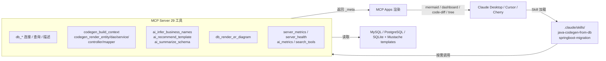

[](https://mseep.ai/app/zhaoxingpeng-dbjavagenix)

# DBJavaGenix

> 把"用 LLM 看着数据库做反向工程"做成一件可重复、可审计的事。
> Skills 定义"怎么做" · MCP 提供"能做什么" · MCP Apps 让结果"看得见"。

[](https://github.com/ZhaoXingPeng/DBJavaGenix/actions/workflows/ci.yml)



## 它解决什么问题

把数据库表反向生成成 Spring Boot 工程 (Entity/DAO/Service/Controller/Mapper) 不是新东西 —— EasyCode、MyBatis-Plus Generator、Renren-generator 都做了多年。**LLM 时代的区别在于:**

| 维度 | 老工具 | DBJavaGenix v0.2 |
|------|--------|------------------|
| 工作流谁定 | 用户在 IDE 点配置面板 | **Skill 文件显式编排** (LLM 不会乱调) |
| 调用粒度 | 一个大按钮一步到位 | **6 个原子工具** (build_context + 5 个 render_*),LLM 可中途让用户改 context 重渲 |
| 启动开销 | (插件,常驻) | 默认 ~3300 tok / 渐进模式 **~985 tok** (节省 70%) |
| 命名 | 表前缀机械映射 | **15 条规则 + Claude API**,识别 RBAC/电商/CMS 模式 |
| 输出可视化 | IDE 内文本 | **MCP Apps**: Mermaid ER 图 / 依赖仪表盘 / code-diff / 包结构树 |
| 可观测性 | 无 | server_metrics + ai_metrics + server_health |

## 快速开始

### Docker (推荐)

```bash
docker build -t dbjavagenix:latest .
```

在 `claude_desktop_config.json` 添加:
```json
{
  "mcpServers": {
    "dbjavagenix": {
      "command": "docker",
      "args": ["run", "-i", "--rm",
               "-e", "DBJAVAGENIX_PROGRESSIVE=1",
               "-e", "ANTHROPIC_API_KEY",
               "dbjavagenix:latest"]
    }
  }
}
```

### 本地 dev

```bash
git clone https://github.com/ZhaoXingPeng/DBJavaGenix.git
cd DBJavaGenix
uv venv && uv pip install -e ".[dev]"
PYTHONPATH=src python -m dbjavagenix.cli server
```

### 数据库支持范围

当前可连接、查询并读取元数据的数据库为 MySQL、PostgreSQL 和 SQLite。Oracle 与
SQL Server 的类型映射保留为后续扩展准备，但尚未实现运行时驱动和元数据契约，不能作为
当前可用数据库声明。

### 第一次使用

在 LLM 客户端里说 "**从数据库 myapp 的 sys_user / sys_role / sys_user_role 三张表生成 Spring Boot 代码**",Claude 会:

1. 加载 `java-codegen-from-db` Skill,按 5 阶段工作流推进
2. 调用 `db_connect_test` → `db_table_describe` → `db_table_foreign_keys` 收集 schema
3. 调用 `db_render_er_diagram` → 客户端渲染 Mermaid ER 图
4. 调用 `ai_infer_business_names` 推断 → `sys_user_role` 应是 `UserRoleAssignment`
5. 调用 `ai_recommend_template` 推荐 → 检测到 RBAC,推 `MybatisPlus-Mixed`
6. 用 `codegen_build_context` + 5 个 `codegen_render_*` 分层生成,每层返回 code-diff
7. 用户确认后写盘

## 核心能力 (Phase 1 → 5)

### Phase 1 现代化基础
- Python ≥ 3.11 / mcp ≥ 1.6 / Spring Boot 3.5 + Java 21 模板
- 单元测试 360+，GitHub Actions 分层 CI（提交策略、三版本质量、格式、数据库集成、模板、Docker、打包安装）
- 多阶段 Dockerfile (`python:3.11-slim` + 非 root 用户)

### Phase 2 Skills 层与原子工具
- `.claude/skills/java-codegen-from-db/SKILL.md` 显式定义 5 阶段工作流
- `db_codegen_generate` 拆为 6 原子工具,context 显式传递
- `search_tools` 工具实现 progressive discovery,启动 token 节省 70.2%
- 第二个 Skill `springboot-migration` (2.7→3.x 升级 checklist)
- [token usage benchmark](docs/benchmarks/token-usage.md)

### Phase 3 MCP Apps 集成
4 个交互式 UI 组件:

| 组件 | 类型 | 来源工具 |
|------|------|---------|
| ER 图 | `mermaid` | `db_render_er_diagram` |
| 依赖健康仪表盘 | `dashboard` | `springboot_analyze_dependencies` |
| 代码预览 + Diff | `code-diff` | `codegen_render_*` (6 个) |
| 包结构树 | `tree` | `db_codegen_generate` |

[客户端兼容性](docs/screenshots/README.md) + [headless 验证](scripts/verify_mcp_apps.py)。

### Phase 4 AI 语义增强
- `ai_infer_business_names`: 15 条规则 + 可选 Claude API (Anthropic SDK + prompt caching)
- `ai_recommend_template`: 检测 RBAC / 电商 / CMS / 工单 4 种模式
- `ai_summarize_schema`: 整库自然语言概述
- `ai_metrics`: 暴露 cache_hit_rate / tokens_saved
- 设计取舍: **规则先于 LLM**,无 `ANTHROPIC_API_KEY` 也能跑

### Phase 5 可观测性与生产就绪
- `server_metrics`: 每个工具的 calls / avg_duration / error_rate
- `server_health`: Python / mcp / anthropic SDK 版本 + 模块导入状态
- 结构化日志: `DBJAVAGENIX_LOG_FORMAT=json` 可输出单行 JSON,适合 Loki/ELK
- [部署手册](docs/deployment.md): 3 种部署模式 + 6 个排障场景

## 工具总览 (29 个)

| 类别 | 工具 |
|------|------|
| 连接 / 查询 | db_connect_test / db_query_databases / db_query_tables / db_query_table_exists / db_query_execute |
| 表结构 | db_table_describe / db_table_columns / db_table_primary_keys / db_table_foreign_keys / db_table_indexes |
| 代码生成 (atomic) | codegen_build_context / codegen_render_entity / codegen_render_dao / codegen_render_service / codegen_render_controller / codegen_render_mapper |
| 代码生成 (legacy) | db_codegen_analyze / db_codegen_generate |
| Spring Boot 项目 | springboot_validate_project / springboot_analyze_dependencies / springboot_read_config |
| 可视化 | db_render_er_diagram |
| AI 语义 | ai_infer_business_names / ai_recommend_template / ai_summarize_schema / ai_metrics |
| 可观测 | server_metrics / server_health |
| 元工具 | search_tools (渐进发现) |

## 与同类工具对比

| 维度 | DBJavaGenix v0.2 | EasyCode | MyBatis-Plus generator | Renren-generator |
|------|------------------|----------|----------------------|-----------------|
| 驱动方式 | LLM + MCP | IDEA 插件 | 命令行 / Maven plugin | Web UI |
| 工作流编排 | Skill 显式 5 阶段 | 配置面板 | 一次性代码 | 表单 |
| 工具粒度 | 6 原子 (可中途让用户改) | 单按钮 | 单命令 | 单按钮 |
| AI 命名 | ✅ 15 规则 + 可选 LLM | ❌ 纯模板 | ❌ | ❌ |
| 模板扩展 | ✅ Mustache + 4 分类 (sb35-java21 含) | ✅ Velocity | ⚠️ 仅 MybatisPlus | ⚠️ 仅 freemarker |
| ER 图渲染 | ✅ Mermaid (MCP App) | ❌ | ❌ | ⚠️ 静态 |
| 依赖适配 | ✅ 智能档案 + 健康分 | ❌ | ❌ | ❌ |
| 可观测性 | ✅ in-process metrics + health | ❌ | ❌ | ❌ |
| 客户端兼容 | Claude Desktop / Cursor / Cherry / ... | 仅 IDEA | CLI | 浏览器 |

## 技术架构

详见 [`iteration-plan/01-target-architecture.md`](iteration-plan/01-target-architecture.md)。三层职责:

```
[ Skills 层 ]  定义"怎么做" — .claude/skills/*.md  显式 5 阶段工作流
       ↓
[ MCP 层 ]     提供"能做什么" — 29 个原子工具  context 显式传递
       ↓
[ Apps 层 ]    让结果"看得见" — 4 个 UI 组件 (mermaid/dashboard/code-diff/tree)
```

每层都做"工程克制":
- 不引入向量数据库 (schema 是结构化数据,LLM 直接读更准)
- 不引入 LangChain (Skill 已显式编排,不需要 chain 抽象)
- 不引入 prometheus_client / opentelemetry-sdk (stdio 单进程过度设计)

## 文档

| 文档 | 内容 |
|------|------|
| [iteration-plan/](iteration-plan/) | 6 阶段重构方案 (目标架构 / 路线图 / 决策记录 / 演示故事) |
| [docs/deployment.md](docs/deployment.md) | 部署模式 / 环境变量 / 健康检查 / 排障 |
| [docs/benchmarks/token-usage.md](docs/benchmarks/token-usage.md) | tool schema token 测量 |
| [docs/screenshots/README.md](docs/screenshots/README.md) | MCP Apps 4 组件客户端兼容性 |
| [docs/algorithms-overview.md](docs/algorithms-overview.md) | v0.2.1 schema 图算法 (topo / cluster / cycle) |
| [docs/design-patterns-catalog.md](docs/design-patterns-catalog.md) | 生成器与生成代码中的设计模式 |
| [docs/adr/](docs/adr/) | 14 个 ADR (架构 / 原子 / 渐进 / 规则 / 不引依赖 / schema 算法 / 规范配置 / MCP v3 / 1h 缓存 / agentic / 多方言 / SDK 契约 / 工具契约 / 元数据契约) |
| [.claude/skills/java-codegen-from-db/SKILL.md](.claude/skills/java-codegen-from-db/SKILL.md) | 主 Skill: 代码生成 5 阶段工作流 |
| [.claude/skills/springboot-migration/SKILL.md](.claude/skills/springboot-migration/SKILL.md) | 第二 Skill: Spring Boot 2.7→3.x 迁移 |

## 路线图

- [x] **Phase 1**: 基础设施现代化 (Python 3.11 / mcp 1.6 / Spring Boot 3.5 模板 / CI / Docker)
- [x] **Phase 2**: Skills 层抽离 + 原子工具 + Progressive Discovery (token -70%)
- [x] **Phase 3**: MCP Apps 集成 (4 个 UI 组件)
- [x] **Phase 4**: AI 语义增强 (规则 + 可选 LLM)
- [x] **Phase 5**: 可观测性 + 生产就绪
- [x] **Phase 6**: 文档与演示
- [x] **v0.2.1**: Java 工程补完 (schema 算法 3 个 / 工程规范配置生成器 / 设计模式 catalog)
- [x] **v0.2.2**: MCP v3 + AI 工程化 (elicitation 表单 / sampling 借 LLM / 1h prompt caching / agentic-runner)

下一步 (v0.3 候选):
- DB 后端扩展: Oracle / SQL Server 元数据契约与驱动支持
- 抓取 Claude Desktop / Cursor 截图入仓 (P3.5 收尾)
- 集成测试: 用 Testcontainers 把 MySQL 拉起跑端到端
- 性能: 把规则推断与 LLM 路径合并为同一返回 schema (current LLM 路径输出格式与规则略不同)
- agentic-runner 加 subagent 支持 (Agent SDK 已就绪)

## 启动模式

| 模式 | 入口 | 触发 | 依赖 | 适用场景 |
|------|------|------|------|---------|
| MCP server | `dbjavagenix server` | 客户端连接 (Claude Desktop / Cursor 等) | 无额外 | 探索 / 多轮交互 / 默认 |
| Agentic runner | `server.agentic_runner.run_agentic()` | CLI 单次启动 | `claude-agent-sdk` + `ANTHROPIC_API_KEY` | 批处理 / CI / 一次性任务 |

两种模式共用同一 `database.mcp_tools` 注册表 (ADR-010)。

## 调试技巧

```bash
# 启用 progressive 模式 (仅暴露 6 个 always_visible 工具)
DBJAVAGENIX_PROGRESSIVE=1 PYTHONPATH=src python -m dbjavagenix.cli server

# JSON 日志 (适合 Loki / ELK)
DBJAVAGENIX_LOG_FORMAT=json DBJAVAGENIX_LOG_LEVEL=DEBUG \
  PYTHONPATH=src python -m dbjavagenix.cli server

# headless 验证所有 MCP App 组件
PYTHONPATH=src python scripts/verify_mcp_apps.py
```

## 贡献

1. Fork → 创建 feature/* 分支
2. 写测试 (`tests/unit/`),`pytest tests/unit/` 应保持 360+ 全过
3. `ruff check src/ tests/` 通过 (CI 会跑)
4. 提 PR,链接到对应的 iteration-plan 阶段

## 许可证

MIT — 见 [LICENSE](LICENSE)。

## 致谢

- [EasyCode](https://github.com/makejavas/EasyCode) — 早期模板设计灵感
- [Model Context Protocol](https://modelcontextprotocol.io/) — Anthropic / Linux Foundation
- [Anthropic Claude](https://www.anthropic.com/) — AI 语义层

## 联系

- 作者: ZXP · 邮箱: 2638265504@qq.com
- 仓库: https://github.com/ZhaoXingPeng/DBJavaGenix
- Issues: https://github.com/ZhaoXingPeng/DBJavaGenix/issues
